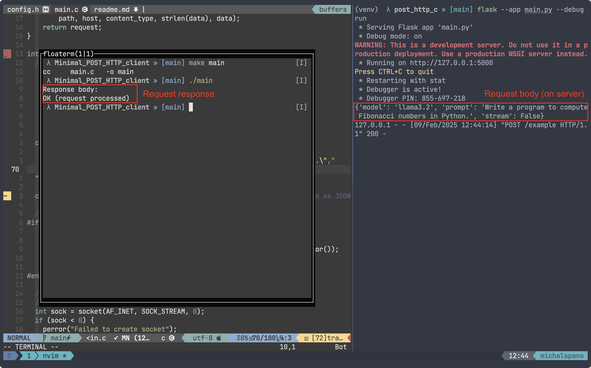

## A minimal `HTTP` (POST) client

This project showcases a minimal `HTTP` (`v1.1`) client that can send `POST`
requests. It is written in `C` and support most `Unix`, Windows systems with a
suitable `C` compiler (e.g. `gcc`). It can virtually send *any type of data* to
a **known server** (ever heard of [`curl`][curl]?). The client is designed to
be simple, minimal, and easy to use.

### Usage

Firstly, **clone** the repository. As said earlier, the `POST` request (given
some body) can be delivered to any **known server**. Navigate to `config.h` to
specify the server's hostname, post, and path (if any, otherwise leave as
`"/"`). Then, in `main.c`, you can specify the body context and its type (the
current implementation sends a 'JSON' object). I've omitted `stdin` input for
simplicity (you can implement this as an exercise!).

Because the source code is contained in a single file, you can compile it using
the following command:

```sh
gcc -o main main.c
# or
make main
```

### Server

Indeed, a client is useless without a server. You can certainly make a server
on your **own** or use a **public** server (preferably with no restrictions).
There's countless ways to make or initialize a server, you can get very
*creative* (see [this][server-how-to] StackOverflow thread for some cool ideas;
the `Unix` interface comes with some pre-built tools as well). The only
requirement is that the server should be able to receive `POST` requests. You
can try implementing this in `C` as well (which is highly recommended!). Have a
look [here][c-server]. However, if you only want to try this client, you can
copy the following source code (Python) to a file and run it:

```python3
from flask import Flask, request

app = Flask(__name__)

@app.route('/')
def hello_world():
    return 'Hello Flask'

@app.route('/example', methods=['POST']) # see config.h
def post():
    data = request.json # gets the JSON object (body)
    # Define any processing here...

    return 'OK (request processed)'

if __name__ == '__main__': app.run()
```

Note that you'll need [`Flask`][python-flask] installed. This can be simply
done with the following commands.

**Unix**:
```sh
# Inside the project directory
python3 -m venv .venv
. .venv/bin/activate
pip install Flask
```

**Windows**:
```powershell
# Inside the project directory
py -3 -m venv .venv
.venv\Scripts\activate
pip install Flask
```

and then initialize the server (in development mode) with

```sh
flask --app main.py --debug run # don't terminate!
```

*Voilà*! You have a server running on `localhost:5000`. You can now run the
client that you previously compiled. If you've followed the instructions
correctly, you should see the message `"OK (request processed)"` in the
client's output (and the request's body in the server's log). See the attached
picture for a visual representation.



<!-- LINKS -->
[curl]: https://curl.se/docs/manpage.html
[server-how-to]: https://unix.stackexchange.com/questions/32182/simple-command-line-http-server#32200
[c-server]: https://github.com/miroslawstaron/DIT633_lecture_3/blob/main/file_sockets_server.c
[python-flask]: https://flask.palletsprojects.com/en/stable/installation/
